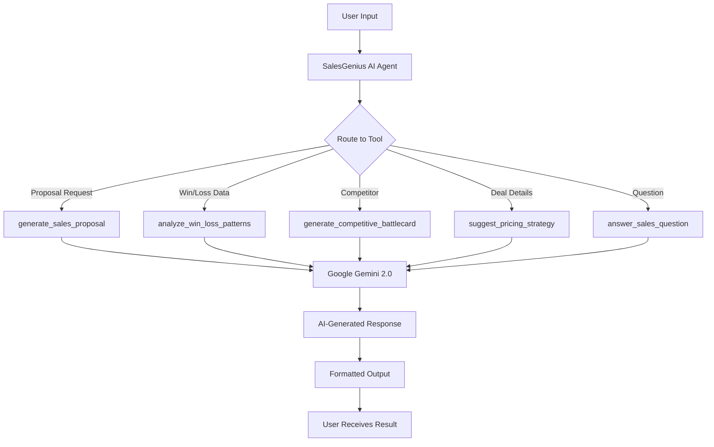

<div align="center">

# 💼🤖 SalesGenius AI Agent

### *Your Intelligent B2B Sales Assistant Powered by Google Gemini*

[](https://ai.google/)
[](https://www.python.org/)
[](https://cloud.google.com/run)

---

**SalesGenius AI** is an intelligent sales assistant that automates proposal generation, analyzes win/loss patterns, creates competitive battle cards, suggests optimal pricing strategies, and provides expert sales guidance. Built with Google's Gemini 2.0 Flash model and designed for B2B sales teams, agencies, and consultancies.

[Features](#-features) • [Quick Start](#-quick-start) • [Usage](#-usage-examples) • [Deploy](#-deploy-to-cloud-run) • [Demo](#-demo-scenarios)

</div>

---

## 🎯 Business Value

### For Sales Teams
- **70% faster proposal creation** - Generate customized proposals in minutes, not hours
- **10-15% higher win rates** - Data-driven insights from win/loss analysis
- **Instant competitive intelligence** - Battle cards for any competitor on demand
- **Optimized pricing** - AI-powered pricing recommendations maximize revenue

### For Sales Leaders
- **Pipeline acceleration** - Reduce sales cycle length by 20-30%
- **Consistent quality** - Every proposal meets high standards
- **Competitive advantage** - Real-time battle cards keep reps prepared
- **Revenue optimization** - Smart pricing strategies increase deal values

### For Agencies & Consultancies
- **Scale without hiring** - Handle more deals with same team size
- **Professional positioning** - Impress clients with polished materials
- **Win more bids** - Higher quality proposals win more business
- **Pricing confidence** - Data-driven pricing justifications

---

## ✨ Features

### 1. 📄 Sales Proposal Generation
Generate customized, professional B2B sales proposals from prospect data and discovery notes.

**Includes:**
- Executive Summary with compelling value proposition
- Understanding of Client Needs (pain points from discovery)
- Proposed Solution tailored to requirements
- Pricing & Investment with ROI justification
- Implementation Timeline & Next Steps
- Terms & Conditions

**Input:** Prospect info, discovery notes, deal value, timeline  
**Output:** Complete proposal ready to send

### 2. 📊 Win/Loss Pattern Analysis
Analyze historical deal data to identify success patterns and failure reasons.

**Provides:**
- Win rate metrics by segment, deal size, competitor
- Top reasons for lost deals with percentages
- Success factors in won deals
- Competitive intelligence (who you lose to and why)
- Actionable recommendations to improve close rates

**Input:** Historical deal data (won/lost with reasons)  
**Output:** Comprehensive analysis with action items

### 3. ⚔️ Competitive Battle Cards
Create detailed battle cards to position against any competitor.

**Includes:**
- Competitor overview and positioning
- Head-to-head feature comparison table
- Your strengths vs their weaknesses
- Common objections with killer responses
- Pricing intelligence and TCO comparison
- Win/loss engagement strategy
- Proof points and customer stories

**Input:** Competitor name, your product info  
**Output:** Complete battle card for sales reps

### 4. 💰 Pricing Strategy Recommendations
Suggest optimal pricing based on deal characteristics and market context.

**Provides:**
- Recommended price point with justification
- Discount strategy (if/when/how much)
- Multiple payment term options
- Bundling opportunities
- Negotiation guardrails (walk-away price)
- ROI calculations for value messaging
- Risk assessment and probability to close

**Input:** Deal data, market context, competitor pricing  
**Output:** Strategic pricing playbook

### 5. 🎓 Sales Expert Q&A
Answer questions about sales methodology, objection handling, and deal strategies.

**Topics:**
- Objection handling techniques
- Discovery call best practices
- Closing strategies
- Negotiation tactics
- Sales methodologies (MEDDIC, Challenger, SPIN)
- Pipeline management
- CRM best practices

**Input:** Any sales question with optional context  
**Output:** Expert advice with specific tactics

---

## 🚀 Quick Start

### Prerequisites
- Python 3.8 or higher
- Google AI API key ([Get it here](https://aistudio.google.com/app/apikey))
- Git

### Installation

1. **Clone the Repository**
   ```bash
   git clone https://github.com/Nyambura20/Obi-Kaya.git
   cd Obi-Kaya
   ```

2. **Create Virtual Environment**
   ```bash
   python -m venv venv
   
   # Activate on macOS/Linux:
   source venv/bin/activate
   
   # Activate on Windows:
   venv\Scripts\activate
   ```

3. **Install Dependencies**
   ```bash
   pip install -r requirements.txt
   ```

4. **Configure Environment Variables**
   ```bash
   cp .env
   
   # Edit .env and add your Google API key
   nano .env  # or use your preferred editor
   ```
   
   Your `.env` file should look like:
   ```env
   GOOGLE_API_KEY=your_actual_api_key_here
   APP_NAME=SalesGenius AI Agent
   ENVIRONMENT=development
   ```

5. **Test the Setup**
   ```bash
   python test_agent.py
   ```
   
   You should see:
   ```
   ✅ ALL TESTS PASSED!
   🎉 Your SalesGenius AI Agent is ready to use!
   ```

6. **Run the Agent**
   ```bash
   adk web
   ```
   
   Open your browser to `http://localhost:8080`

---

## 📖 Usage Examples

### Example 1: Generate a Sales Proposal

**Input:**
```
Use the tool: generate_sales_proposal

Prospect Data:
Company: TechFlow Solutions Inc.
Industry: Financial Services
Size: 250 employees
Challenge: Manual processes taking 15+ hours/week, 12% error rate
Requirements: Workflow automation, CRM integration, AI validation
Budget: $200K approved
Timeline: Q1 2025 deployment

Discovery Notes:
- Lost $2M client due to slow onboarding
- CFO needs clear ROI story
- VP Operations is our champion, loves AI features
- Competing against Salesforce and Microsoft
```


### Example 2: Analyze Win/Loss Patterns

**Input:**
```
Use the tool: analyze_win_loss_patterns

Load the data from: sample_data/win_loss_data.txt
Focus: Why are we losing to Salesforce?
```

### Example 3: Create a Battle Card

**Input:**
```
Use the tool: generate_competitive_battlecard

Competitor: Salesforce
Our Product: AI-powered workflow automation platform
```


### Example 4: Get Pricing Strategy

**Input:**
```
Use the tool: suggest_pricing_strategy

Deal: TechFlow Solutions (see prospect example)
Budget: $200K approved
Competition: Evaluating Salesforce ($250K) and Microsoft ($180K)
Urgency: High - need to close in Q1
```

### Example 5: Ask Sales Questions

**Input:**
```
Use the tool: answer_sales_question

Question: How do I handle the objection "We need to think about it"?
Context: Enterprise deal, $300K, met with VP but not CEO yet
```

---

## 🎬 Demo Scenarios

Test the agent with these realistic scenarios using the sample data provided:

### Scenario 1: New Deal - Create Winning Proposal
1. Open the agent interface
2. Load `/sample_data/prospect_example.txt`
3. Ask: "Generate a sales proposal for TechFlow Solutions. Deal value $185K, 90-day implementation."
4. Review the customized proposal
5. Edit and send to prospect

### Scenario 2: Lost Deal Analysis
1. Load `/sample_data/win_loss_data.txt`
2. Ask: "Why are we losing deals? What patterns do you see?"
3. Get actionable insights
4. Ask follow-up: "Create a battle card for Salesforce based on this data"
5. Get battle card with objection handling

### Scenario 3: Pricing Negotiation
1. Share deal details: "Manufacturing company, $400K deal, competing with Salesforce at $450K"
2. Ask: "What pricing should I offer?"
3. Get strategic pricing recommendation
4. Ask: "They want 20% discount. Should I agree?"
5. Get negotiation guidance

---


---

## 🏗️ Project Structure

```
Obi-Kaya/
├── obi_kaya_agent/
│   ├── __init__.py           # Package initialization
│   └── agent.py              # Main agent with 5 tools
├── sample_data/
│   ├── prospect_example.txt  # Sample prospect data
│   └── win_loss_data.txt     # Sample deal history
├── .env                      # Your config (create this)
├── .gitignore               # Git ignore rules
├── .dockerignore            # Docker ignore rules
├── requirements.txt         # Python dependencies
├── Dockerfile               # Container definition
├── deploy.sh                # Cloud Run deployment script
├── test_agent.py            # Setup verification script
└── README.md                # This file
```

---

## 🛠️ How It Works

### Architecture



### Technology Stack

- **AI Model:** Google Gemini 2.0 Flash Experimental
- **Framework:** Google ADK (Agent Development Kit)
- **Language:** Python 3.8+
- **Deployment:** Google Cloud Run (containerized)
- **Environment:** python-dotenv for configuration

### Tool Details

Each tool is a Python function that:
1. Validates input data
2. Constructs an expert prompt for Gemini
3. Calls the Gemini API
4. Parses and formats the response
5. Returns structured output (JSON or formatted text)

The agent orchestrates these tools based on user intent, handling context and routing automatically.

---

## 💡 Tips for Best Results

### Proposal Generation
- ✅ Include specific pain points from discovery
- ✅ Mention competitor names if known
- ✅ Provide budget signals or ranges
- ✅ Include timeline/urgency indicators
- ❌ Don't be vague about requirements

### Win/Loss Analysis
- ✅ Include at least 5-10 deals for patterns
- ✅ Specify exact loss reasons (not just "lost")
- ✅ Note competitors for each deal
- ✅ Include deal size and timeline
- ❌ Don't mix different time periods

### Battle Cards
- ✅ Name specific competitors
- ✅ Provide your product differentiators
- ✅ Include any known competitive intel
- ❌ Don't create generic "competition" cards

### Pricing Strategy
- ✅ Share budget signals from prospect
- ✅ Include competitor pricing if known
- ✅ Mention deal urgency/timing
- ✅ Specify company size and industry
- ❌ Don't ask for pricing without context


## 🤝 Contributing

Found a bug or have a feature idea? Contributions are welcome!

1. Fork the repository
2. Create a feature branch (`git checkout -b feature/amazing-feature`)
3. Commit your changes (`git commit -m 'Add amazing feature'`)
4. Push to the branch (`git push origin feature/amazing-feature`)
5. Open a Pull Request

---

